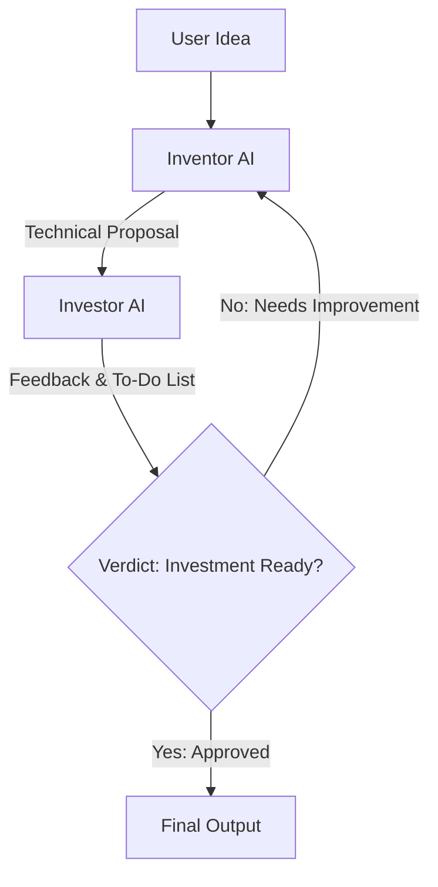

# AI Inventor ↔ Investor System

An agentic simulation system built in Python utilizing the Google GenAI SDK. The project simulates a recursive, forward-chaining feedback loop between two specialized AI agents: an **Inventor AI** (Technical Researcher) and an **Investor AI** (VC + Industry Expert).

---

## Architecture Overview

The system runs a **forward-chaining multi-agent loop** where a product idea is iterated on, refined, and critiqued.



### 1. Inventor AI (Technical Researcher)
*   **Role**: Technical designer and researcher.
*   **Input**: The user's initial idea, along with any feedback/to-do list generated by the Investor.
*   **Task**:
    *   Generates a structured technical proposal.
    *   Systematically addresses feedback and justifies technical decisions.
*   **Structured Output**:
    1. Justification Log (resolving previous Investor feedback).
    2. Refined Product Overview.
    3. Core Features.
    4. Technical Architecture.
    5. Hardware & Software Requirements.
    6. Manufacturing & Deployment Plan.
    7. Cost & Scalability.
    8. Market Use Cases.

### 2. Investor AI (VC & Industry Expert)
*   **Role**: Evaluator, critic, and gatekeeper.
*   **Input**: The generated Technical Proposal from the Inventor.
*   **Task**:
    *   Critiques the proposal and organizes feedback into action items.
    *   Structures feedback into categorized "Task Branches" (e.g., tech scalability, legal compliance, market fit).
    *   Decides if the project is ready for investment.
*   **Structured Output**:
    1. Executive Summary.
    2. Task Branches (Actionable To-Do List).
    3. Final Verdict: `INVESTMENT READY` or `NEEDS IMPROVEMENT`.

---

## File Structure

*   [main.py](file:///d:/vscode/presentor_ai/main.py): The entry point script that handles console inputs/outputs and initiates the multi-agent loop.
*   [agents.py](file:///d:/vscode/presentor_ai/agents.py): Defines the agent system prompt configurations, model interaction logic, and the forward-chaining loop execution (`run_forward_chain`).
*   `.env`: Holds environment credentials (e.g., API keys).

---

## Installation & Setup

1.  **Activate the Environment**:
    Activate your pre-configured virtual environment:
    ```powershell
    aii\scripts\activate
    ```
2.  **Install Dependencies**:
    Install the Google GenAI SDK:
    ```bash
    pip install google-genai
    ```
3.  **Environment Configuration**:
    Create a `.env` file in the root directory (or update the existing one) with your Gemini API Key:
    ```env
    GEMINI_API_KEY="your_api_key_here"
    ```
    *Note: The SDK client in [agents.py](file:///d:/vscode/presentor_ai/agents.py) initializes using `os.getenv("GEMINI_API_KEY")`.*

---

## Usage

Start the interactive terminal application:
```powershell
python main.py
```

1.  Enter your raw project/product idea when prompted.
2.  The application will run up to a maximum of 10 loops (`MAX_PASSES`).
3.  Each pass shows the Inventor's technical proposal followed by the Investor's detailed feedback.
4.  The loop terminates early if the Investor's verdict contains `INVESTMENT READY`.
5.  The final approved technical proposal will be outputted to the console.
